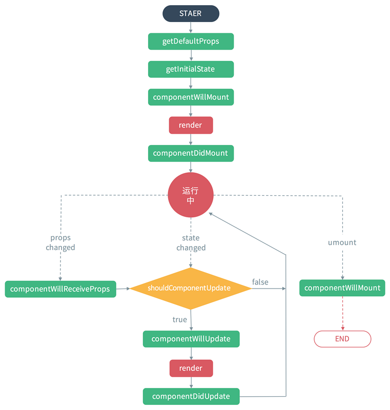
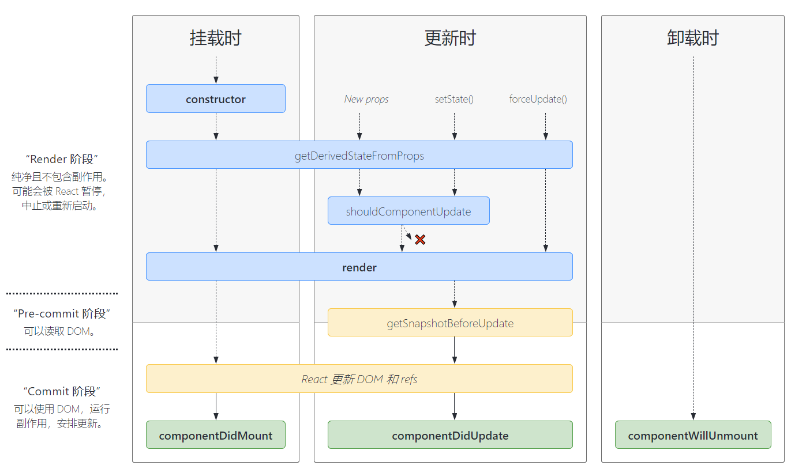
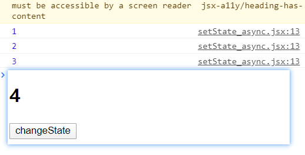

# React

react和vue一样也是一个种渐进式的前端框架，它不仅能用于构建单页应用，也可以在现有的多页应用的某一些页面上使用。这个可以根据自己的使用cdn的方式在默写页面使用react来构建项目。

## 创建项目

### 通过cdn创建项目

```html
<!DOCTYPE html>
<html lang="en">
<head>
    <meta charset="UTF-8">
    <meta name="viewport" content="width=device-width, initial-scale=1.0">
    <title>Document</title>
</head>
<body>
    <div id="app"></div>
  	<script src></script> 
</body>
</html>
```


### 通过react脚手架创建项目

对于 nodejs 版本大于等于5.6 可以直接使用 npm 自带的` create-react-app `命令进行构建

```shell
# 创建项目
npx create-react-app my-app
# 进入项目并运行
cd my-app
npm start
```

`create-react-app`命令中是使用 babel 和 webpack 了。

如果不想使用`create-react-app`进行创建项目可以使用npm自己搭建，但是需要安装`react`和`react-dom`这两包，同时对于解析react语法代码可能需要使用 `@babel/preset-react`。

## React基础

### jsx语法

react支持 jsx 语法，jsx 是指融合了JavaScript 和 XML的新语法 ，比如react的渲染函数

```react
let react="React";
ReactDOM.render(<h1>hello {react}</h1>,document.getElementById('app'));
```

这里的 `ReactDOM.render(html,target)`中 html就是xml语法，在解析 jsx 的时候语法`<>`就会按 html 解析得到dom节点，遇到`{}`就会按 js 语法解析，然后会将这个节点插入到target目标节点中，并执行 js代码。


### 元素渲染

 React 元素是不可变对象。一旦被创建，你就无法更改它的子元素或者属性。一个元素就像电影的单帧：它代表了某个特定时刻的 UI。

也就是无法通过像代码插值的方式进行修改元素`<{tag}>`，所以只能通过dom操作或者直接使用`ReactDOM.render(html,target)`方法重新渲染，在html中可以使用想php那样的混合式开发，这里你可能会觉得从新渲染dom会很消耗性能，但是由于react的虚拟dom和diff算法的原因，在渲染同一块dom的情况下只会去更新有变化的dom，所以性能方法不会有太大的损耗。比如

```react
//():如果存在标签结构，并且标签结构要换行，需要使用() 括起来
function trik(){
  let element=(
  	<div>
      <h1>hello world!</h1>
      <h2>It is {new Date().toLocaleTimeString()}</h2>
    </div>
  )
  ReactDom.render(element,document.getElementById('root'));
}
setInterval(()=>{
  trik();
},1000)
```

如果打开开发者工具就会看到 只有`<h2>`标签的 时间那部分文本节点变化，其他的几点都不会被重新渲染。


### React组件化

像vue一样组件有组件的文件，对于vue而言组件的文件可以是vue，而对于react可以是 js 也可以是 jsx（这种文件有代码提示）。

可以使用 类 或 hook 的方式创建 react 组件.

```jsx
import React from "react";
import Home from "./home";//其他组件
//使用类的新式创建组件
export default class App extends React.Component{
  //渲染函数
  render(){
    return (
      <div>
        <h1>hello react component</h1>
        <Home />
      </div>
    )
  }
}
```

在入口中使用

```jsx
import App from "./app";
ReactDom.render(App,document.getElementById("root"));
```


### 组件的props属性

组件的复用性很重要，但是这就需要要组件是一样可配置，可复用的组件的了，也就是根据自己的需求或者提供的数据来渲染出自己想要的效果。在组件里面的render函数中提供了一个`props`属性，通过这个属性可以访问到父组件在**子组件标签**通过属性绑定的值中传入的数据，**但是该属性是只读（readonly）的**，所以不可以在子组件中修改数据。这也是react的特点之一——单向数据流。

```js
//父组件 father.jsx
import MyList from './child'
export default class Father extends React.Component{
  render(){
    const list=['java','javaScript','c','c++'];
    
    return (
    	<MyList listData=list title="langues learning" />
    )
  }
} 
```

```jsx
//子组件 child.jsx
export default class MyList extends React.Component{
  render(){
    const fatherData=this.props.listData;
    const title=this.props.title;
    return (
      <div>
        <h2>{title}</h2>
        {/**jsx 语法的注释*/ }
        <ul>
          {
            fatherData.map((element, index) => {
              return <li key={index}>{element}</li>
            })
          }
        </ul>
      </div>
    )
  }
} 
```

需要注意的是，和vue2的`<template>`标签一样，render函数只能 return 一个节点，如果是多个的话就会报错。比如这样：

```jsx
export default class Test extends React.Component{
  render(){
    return (
      <h1>test1</h1>
      <h2>test2</h2>
    )
  }
} 
```


### 组件的state

组件中的state（StateComponent），说白了就是组件自己内部的先定义数据（可以理解为vue2中组件的data函数），state可以在组件的构造函数`constructor`中定义。在组件中通过`this.state.count`访问。通过`this.setState(newVal)`更新（不要直接通过`this.state.count=0`这种方式修改state对象的值）。

```jsx
export default class Test extends React.Component{
  constructor(props){
    super(props);
    this.state={
      count:1,
      flag:true,
    }
  }
  addCount(){
    this.setState({
      count:this.state.count+=1
    })
  }
  cutCount(){
    this.setState({
      count:this.state.count-=1
    })
  }
  render(){
    let showVal=this.state.flag?'hello':'gun';
    return (
     	<div>
        {showVal}
        <h1>current count:{this.state.count}</h1>
        <button onClick={this.addCount.bind(this)}>add count</button>
        <button onClick={this.cutCount}>cut count</button>
      </div>
    )
  }
}
```

**注意**：在绑定事件的时候需要使用`bind`或者箭头函数改变`this`，使`this`指向为当前组件，因为`onClick={this.addCount}`相当于`onClick=function(){...}`，当编译成js之后调用方法，this 就会指向window，window上是没有 setState 方法的，所以会报错。**还有就是尽量避免将props的值复制给state**


### React生命周期函数





- componentWillMount：在组件渲染之前执行
- componentDidMount：在组件渲染之后执行
- shouldComponentUpdate：返回true或者false，true代表允许改变，false代表不允许改变，即使设置为true也不能在子组件中修改props的值
- componentWillUpdate：在数据改变之前执行
- componentDidUpdate：数据修改完成时执行（state，props）
- componentWillReveiceProps：props发生改变时执行
- componentWillUnmount：组件卸载前执行

```jsx
//父组件
export default class LifeFather extends React.Component{
	constructor(props){
    super(props);
    this.state={
      title:'life-cycle'
    }
  }
  changeTitle=()=>{
    this.setState({
      title:`life-cycle${Math.random()*10}`,
    })
  }
  changeData=(data)=>{
    this.setState({
      title:data,
    })
  }
  render(){
    return (
      <div>
        <Life-child fatherTitle={this.state.title} changeFatherData={this.changeData} />
        <button onClick={this.changeTitle}>changeTitle</button>
      </div>
    )
  }
}
```

```jsx
//子组件
export default class LifeChild extends React.Component{
	constructor(props){
    super(props);
    this.state={
      data:`state${Math.random()*10}`
    }
  }
  componentWillMount=()=>{
    console.log("componentWillMount")
  }
  componentDidMount=()=>{
    console.log("componentDidMount")
  }
  shouldComponentUpdate=()=>{
    console.log("shouldComponentUpdate")
    return true;
  }
  componentWillUpdate=()=>{
    console.log("componentWillUpdate")
  }
  componentDidUpdate=()=>{
    console.log("componentDidUpdate")
  }
  componentWillReveiceProps=()=>{
    console.log("componentWillReveiceProps")
  }
  componentWillUnmount=()=>{
    console.log("componentWillUnmount")
  }
  changeChildProps=()=>{
    this.props.fatherTitle=`child-props${Math.random()*10}`
  }
  changeState=()=>{
		this.setState({
      data:`state${Math.random()*10}`
    })
  }
  changerParentData=()=>{
    this.props.changeFatherData("child change fater");
  }
  render(){
    return (
      <div>
        <h1>this father title:{this.props.fatherTitle}</h1>
        <h2>this Child props (fater-title):{this.props.fatherTitle}</h2>
        <h2>this Child state:{this.state.data}</h2>
        <button onClick={this.changeChildProps}>changeChildProps</button>
        <button onClick={this.changeState}>changeState</button>
        <button onClick={this.changerParentData}>changerParentData</button>
       </div>
    )
  }
}
```

**注意**：当shouldComponentUpdate返回的是true时，能改变的是父子组件的state，当返回的是false 时，父子组件的state都是不能改变的，即使是在父组件中的shouldComponentUpdate返回的是true也不行。

**组件间传值**

react的组件间传值和vue的传值方式是一样的

**父传子**：在子组件标签的属性绑定父组件的数据，然后再子组件通过props属性访问

**子传父**：在子组件标签的属性绑定父组件的方法，然后再子组件通过props属性调用父组件的方法并传值

和vue一样除了这种方式之外，也可以使用事件车或者redux实现组件间的通信。


### setState方法是同步还是异步？

1. setState会引起视图的重绘
2. 在可控的情况下是异步的，在非可控的情况下是同步

```jsx
import React from 'react';
export default class SetStateAsync extends React.Component{
    constructor(){
        super();
        this.state={
            count:1
        }
    }
    changeState(){
        this.setState({
            count:this.state.count+1
        })
        console.log(this.state.count);
    }
    render(){
        return (
            <div>
            <h2>{this.state.count}</h2>
            <button onClick={this.changeState.bind(this)}>changeState</button>
            </div>
        )
    }
}
```

当这样写的时候你会发现视图更新了，但是打印出来的值永远都是前面的值，不是实时更新的值。此时的 this.setState 是异步的。



如果想要实时更新的值可以这样写

```jsx
this.setState({
  count:this.state.count+1
},()=>{
  console.log(this.state.count);
})
```

也可以使用es6的新特性 async - await 和promise实现同步形式

```jsx
import React from 'react';
export default class SetStateAsync extends React.Component{
    constructor(){
        super();
        this.state={
            count:1
        }
    }
    async changeState(){
        await this.setStateAsync({ count: this.state.count + 1})
        console.log(this.state.count);
    }
    setStateAsync(state){
        return new Promise((resolve)=>{
            this.setState(state,resolve);
        })
    }
    render(){
        return (
            <div>
            <h2>{this.state.count}</h2>
            <button onClick={this.changeState.bind(this)}>changeState</button>
            </div>
        )
    }
}
```


### 条件渲染

就是根据自定义的条件渲染指定的dom节点。常见的使用场景是：对视图进行条件切换，做缺省值。但是在react里面并没有像vue里面的指令 v-if 或者 v-show 。在react中使用的条件渲染的方式是使用三元运算或者if（js语法）。

```jsx
import React from 'react';
export default class SetStateAsync extends React.Component {
    constructor() {
        super();
        this.state = {
            isLogin: false,
        }
    }
    login() {
        this.setState({
            isLogin: true
        })
    }
    render() {
        let loginTitle = this.state.isLogin ?
            'is Login' : 'please Login';
        return (
            <div>
                <h2>{loginTitle}</h2>
                {
                    this.state.isLogin ? <div>{(() => <a href="//#region ">is Login</a>)()}</div> : <a href="//#region ">please Login</a>
                }
                <button onClick={this.login.bind(this)}>login</button>
            </div>
        )
    }
}
```

如果**想要阻止组件渲染 / 隐藏组件可以将 render 函数返回 null。**


### react的表单以及受控组件和非受控组件

在表单中很多时候都会给用户操作，即让用户进行输入，选择等的操作，一般情况我们想要将用户的操作的新数据同步保存下来就需要使用到dom获取到节点的值然后将值保存更新到系统中，但是在react，vue等框架中是是不需要开发者过多得操作dom的。这就需要自动将数组保存下来的程序了，vue有双向数据绑定的特性所以只需要使用`v-model`指令实现即可，但是react中是没有这个特性的，所以也可以使用state结合onchange事件进行实现。

```jsx
import React from 'react';
export default class SetStateAsync extends React.Component {
    constructor() {
        super();
        this.state = {
            value: '',
        }
    }
    changeHandler=(e)=>{
        this.setState({
            value: e.target.value
        })
    }
    render() {
        return (
            <div>
               <input type='text' value={this.state.value} onChange={this.changeHandler}></input>
            </div>
        )
    }
}
```

这种受state进行管控并且组件可以根据state做成相应表现的叫做**受控组件。**

但是这种当你有很多的事件表单属性值需要进行管控的话，就可能需要有很多个不同的change事件了，当然后也可以是使用name属性进行自动适配

```jsx
import React from 'react';
export default class SetStateAsync extends React.Component {
    constructor() {
        super();
        this.state = {
            username: '',
          	password:'',
        }
    }
    changeHandler=(e)=>{
        this.setState({
            [e.target.name]: e.target.value
        })
    }
    render() {
        return (
            <div>
               <input type='text' value={this.state.username} onChange={this.changeHandler} name='username'></input>
            <input type='password' value={this.state.password} onChange={this.changeHandler} name='password'></input>
            </div>
        )
    }
}
```


### Refs属性

下面是几个适合使用 refs 的情况：

- 管理焦点，文本选择或媒体播放。
- 触发强制动画。
- 集成第三方 DOM 库。

当我们需要是在是需要使用到dom的时候就可以使用**非受控组件**。使用refs属性可以直接获取到绑定的dom了

```jsx
import React from 'react';
export default class SetStateAsync extends React.Component {
    constructor() {
        super();
        this.myUsername=React.createRef();
        this.myPassword=React.createRef();
    }
    submitTxt=(e)=>{
        console.log(this.myUsername,this.myPassword)
    }
    render() {
        return (
            <div>
               <input type='text' ref={this.myUsername}></input>
            	 <input type='password' ref={this.myPassword}></input>
            	 <button onClick={this.submitTxt}></button>
            </div>
        )
    }
}
```

不过毕竟不推荐操作dom，所以可以使用受控组件尽量不要使用非受控组件


### 状态提升

因为在react中组件的状态是相对封闭的，也就是其他的组件不可以直接的获取或访问到组件中的state状态数据，如果想要实现组件间的通信，父子组件间可以通过方法和props的方式传递值。兄弟组件间的传值就需要父子组件间的规则，以父组件来作为桥梁，作为中心数据源，子组件通过调用父组件的方法来间接修改兄弟件的值。也就是在兄弟组件间通信的时候就需要使用到**状态提升**（状态数据中心化）

软妹币和多乐的转换例子  1多乐=7软妹币

```jsx
// child.jsx
import React from 'react';
export default class Child extends React.Component {
    constructor() {
        super();
        this.state={
          type:null,
          value:1
        }
    }
  	componentDidMount(){
      this.setState({
        type:this.props.type
        value:this.props.value
      })
    }
    changeValue=(e)=>{
        this.props.changeValue(this.state.type,this.state.value);
    }
    render() {
        return (
            <fieldset>
            <legend>{this.state.type}</legend>
            <input type='text' vlaue={this.state.value} onChange={this.changeValue}></input>
            </fieldset>
        )
    }
}
```

```jsx
// parent.jsx
import React from 'react';
import MoneyChild from './moneyChild';
export default class Child extends React.Component {
    constructor() {
        super();
        this.state={
          rmbType:1,
          doleType:7,
        }
    }
    changeValue=(type,value)=>{
      	let changeType=type=='rmbType'?'doleType':'rmbType';
      	let changeValue=type=='rmbType'?value/7:value*7;
        this.setState({
          [changeType]:changeValue
        });
    }
    render() {
        return (
            <div>
          		<MoneyChild type={'rmbType'} value={this.state.rmbType} changeValue={this.changeValue}></MoneyChild>
            	<MoneyChild type={'doleType'} value={this.state.doleType} changeValue={this.changeValue}></MoneyChild>
          	</div>
        )
    }
}
```


### 组件的组合使用（slot）

在react中并没有slot这个属性，不像vue可以在一个组件中定义一个插槽slot然后可以将组件中插入的内容直接放入到指定的插槽位置，但是在react 中有组合这个概念。可以通过`this.props.children`获取得到组件中插入的全部内容，如果想要将内容插入到指定的位置也可以使用props传递组件，通过`this.props.xxx`来访问。props是可以传递任意类型的数据，十分强大。

```jsx
import React from 'react';
export default class Child extends React.Component {
  render(){
    return (
    	<div>
      	{this.props.title}
        {this.props.content}
        {this.props.children}
      </div>
    )
  }
}
```

```jsx
import React from 'react';
import Child form './child'
export default class Parent extends React.Component {
  render(){
    return (
    	<Child
        title={<h2>hello</h2>}
        content={<h3>world</h3>}
        >
        <p>Are you sure?</p>
        <button>yes</button>&nbsp;&nbsp;
        <button>no</button>
      </Child>
    )
  }
}
```

