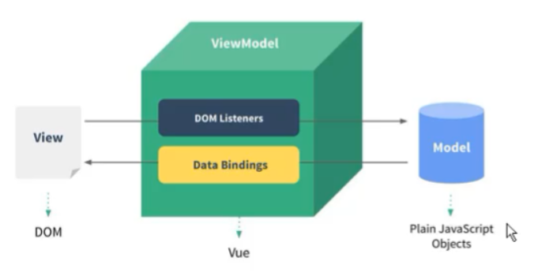
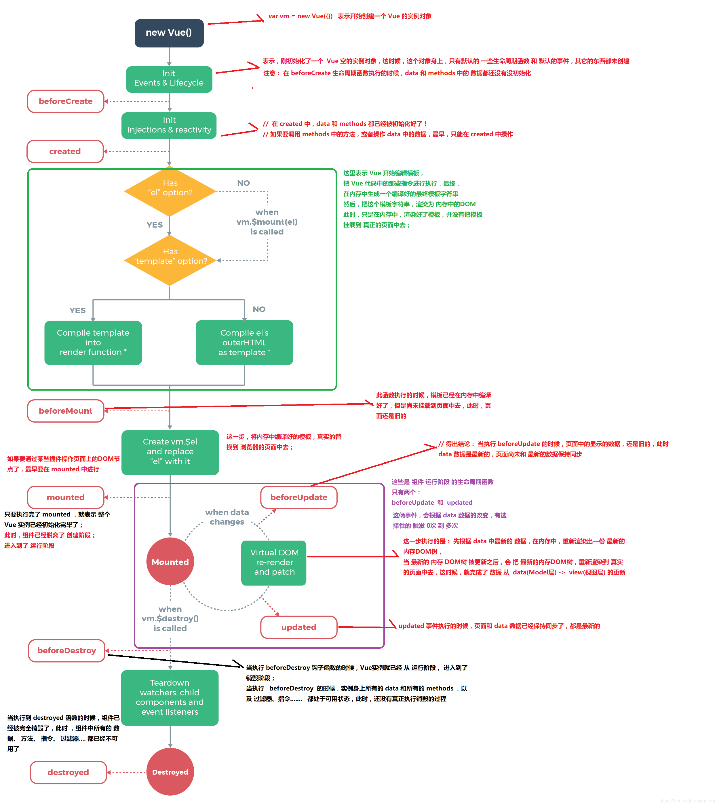

# VUE2基础

是一套用于构建用户界面的**渐进式框架**。与其它大型框架不同的是，Vue 被设计为可以自底向上逐层应用。Vue 的核心库只关注视图层，不仅易于上手，还便于与第三方库或既有项目整合。另一方面，当与[现代化的工具链](https://cn.vuejs.org/v2/guide/single-file-components.html)以及各种[支持类库](https://github.com/vuejs/awesome-vue#libraries--plugins)结合使用时，Vue 也完全能够为复杂的单页应用提供驱动。

以往我们通过dom获取到HTML元素或者使用js生成html的元素，然后再对这个元素进行操作的方式叫做编程式渲染，但是vue使用的是声明式的渲染后，及将页面和逻辑操作分开，页面只需要负责页面结构表现即可，逻辑操作只需负责数据的操作就好不再需要关心页面的事情。这种声明式渲染将使得项目更加易于管理。

## VUE中的MVVM



M:模型层（主要负责业务数据相关）

1. 视图层

2. 数据可能是我们固定的死数据，更多的是来自我们服务器，从网络上请求下来的数据。

   （可以理解为vue中的data）

V:视图层（负责视图相关，细分下来就是html+css层）

1. 前端开发中通常是DOM层
2. 主要作用是给用户展示各种信息

VM:视图模型层（负责监听M或者V的修改，是实现MVVM双向绑定的要点）

1. 是view和model沟通的桥梁

2. 一方面它实现了Data Binding（数据绑定）,将model的改变实时反应到了View中

3. 另一方面它实现了DOM listener，也就是DOM监听，当DOM发生一些事情，比如点击、滚动、touch等时，可以监听到，并在需要的情况下改变对应的Data。

   （可以理解为vue实例，当有DOM中数据变化是vue实例会解析DOM中vue的指令等进而响应到data中）

[MVC，MVP 和 MVVM 的图示](http://www.ruanyifeng.com/blog/2015/02/mvcmvp_mvvm.html)

[理解VUE双向数据绑定原理和实现](https://www.jianshu.com/p/e7ebb1500613)

[vue核心之虚拟DOM(vdom)](https://www.jianshu.com/p/af0b398602bc)


## 数据与方法

```js
let v m=new Vue({
  el:"#app",
  data:{
    arr:['jack','rocy','bear','lily'];
  }
})
```

**注意点：**

无法检测data中的数据

1. 当一个实例创建的时候，vue会将他的data中的数据加入到Vue的响应式系统中，也就是所之后再vue实例创建之前在data中的数据才会是响应式的（被Object.defineProperty()劫持，其实也应该加入了发布订阅模式）。在之后添加的属性如`this.$vm.newProp=2;`这个属性将不会是响应式的，但是可以通过`this.$set(target, key, value)`或者`Vue.set(target, key, value)`来添加数据
2. 使用`Object.freeze()`来解除检测
3. 无法监听到数组或者对象内部值的变化

```js
//无法检测直接按下标或者.运算符修改的数据
this.arr[0]="Big";
this.arr.length=2;
this.obj["age"]=18;
this.obj.name="jack";
//这些修改方式都不会被检测并渲染到dom中
```

但是vue可以监听数组或者对象直接的数值改变，还有一些数组的方法也可以被监听

```js
this.arr=['rocy','jack','kali','lily'];
//数组使用做这些方法也是会被监测的push、pop、shift、unshift、splice、sort、reverse
this.obj={
      age:18,
      name:"bear",
    }
```

除了直接改变数组合对象的值的方法也可以使用`this.$set(target, key, value)`或者`Vue.set(target, key, value)`来添加数据，使数组或者对象的元素变成响应式的数据。

```js
this.$set(this.arr,0,"hello");
this.$set(this.obj,age,15);

//或者可以将这个属性添加到vue的watch观察器中
//组件内写法
watch:{
    obj:{
       handler:(n,o)=>{
           //逻辑处理
       },
       deep:true
    }    
```

相比之下，也有非变更方法，例如 map()、filter()、concat() 和 slice()。它们不会变更原始数组，而总是返回一个新数组。当使用非变更方法时，可以用新数组替换旧数组，Vue 为了使得 DOM 元素得到最大范围的重用而实现了一些智能的启发式方法，所以用一个含有相同元素的数组去替换原来的数组是非常高效的操作。

 [vue为什么不能检测数组的变化](https://www.cnblogs.com/youhong/p/12173354.html)


## Vue生命周期函数



[详解vue生命周期](https://segmentfault.com/a/1190000011381906)


## 属性及数据绑定

在vue的开发中会很频繁的使用到这几个指令，`v-bind,v-on,v-model`,可以使用缩写来减少工作量。并且在2.6.0版本后还新增了一个属性的计算属性。

```html
data:{
bindname:"title",
onevent:"click"
}
<div v-bind:title="hello"></div> ==> <div :title="hello"></div> ==> <div :[bindname]="hello"></div>
<div v-on:click="hello"></div> ==> <div @click="hello"></div> ==> <div @[onevent]="alert('hello')"></div>
```

需要注意的是计算属性的名字不能是有大写，应为在编译模板的时候会将这些变量名变成全小写。


## 计算属性和侦听器

```html
<div id="example">
  <p>Original message: "{{ message }}"</p>
  <p>Computed reversed message: "{{ reversedMessage }}"</p>
</div>
```

```js
var vm = new Vue({
  el: '#example',
  data: {
    message: 'Hello', 
    arr:[0,1,2]
  },
  computed: {
    // 计算属性的 getter
    reversedMessage: function () {
      // `this` 指向 vm 实例
      return this.message.split('').reverse().join('')
    },//这种方式其实是简写的方式，并且计算属性也可以写setter
    reversedMessage:{
      get:function(){
        return this.message.split('').reverse().join('')
      },
      set:function(newVal){
        let total=this.arr.reduce((pre,next)=>pre+next,0);
      }
    }
  }
})
```

**计算属性是基于它们的响应式依赖进行缓存的**，也就是说此处响应式的message改变是reversedMessage计算熟悉也会进行改变，会立即反应到dom上。

**为什么不使用方法的方式**

因为计算属性只在相关响应式依赖发生改变时它们才会重新求值。这就意味着只要 `message` 还没有发生改变，多次访问 `reversedMessage` 计算属性会立即返回之前的计算结果，而不必再次执行函数。也就是说当计算属性中依赖的是一个vue中的响应式数据时，计算属性只会在开始的时候计算一次之后就不会再改变。**这个特性需要注意的是在给数组或者对象设置计算属性的时候需要使用能被vue检测的修改形式设置**

```js
computed: {
  now: function () {
    return Date.now()
  },//计算一次后不再更新
  cmpArr1:function(){
    return this.arr[0];
  },//this.arr[0]=5时，计算一次后不再更新
  cmpArr2:function(){
    return this.arr;
  },//this.arr[0]=5时，会计算
}
```

**计算属性computed :** 

1. 支持缓存，只有依赖数据发生改变，才会重新进行计算
2. 不支持异步，当computed内有异步操作时无效，无法监听数据的变化
3. computed 属性值会默认走缓存，计算属性是基于它们的响应式依赖进行缓存的，也就是基于data中声明过或者父组件传递的props中的数据通过计算得到的值

4. 如果一个属性是由其他属性计算而来的，这个属性依赖其他属性，是一个多对一或者一对一，一般用computed
5. 如果computed属性属性值是函数，那么默认会走get方法；函数的返回值就是属性的属性值；在computed中的，属性都有一个get和一个set方法，当数据变化时，调用set方法。

**侦听属性watch：**

1. 不支持缓存，数据变，直接会触发相应的操作；
   2.watch支持异步；
   3.监听的函数接收两个参数，第一个参数是最新的值；第二个参数是输入之前的值；
2. 当一个属性发生变化时，需要执行对应的操作；一对多；
3. 监听数据必须是data中声明过或者父组件传递过来的props中的数据，当数据变化时，触发其他操作，函数有两个参数，
   　　immediate：组件加载立即触发回调函数执行，
      　　deep: 深度监听，为了发现对象内部值的变化，复杂类型的数据时使用，例如数组中的对象内容的改变，注意监听数组的变动不需要这么做。注意：deep无法监听到数组的变动和对象的新增，参考vue数组变异,只有以响应式的方式触发才会被监听到。


## 条件和循环

在vue中有许多的指令可以使用，`v-if   v-else-if  v-else  v-show  v-for  v-html  v-text v-bind  v-on v-model`，这些中属于**条件渲染**的是`v-if`和`v-show`，他们虽然都是按条件渲染指令，但是是有差别的，v-if相当于是在渲染阶段就做了判断如果`v-if='false'`那么这个节点将不会被渲染，如果是从true变为false节点会被直接删除；`v-show`无论是`true`还是`false`节点都会被渲染，只是会对css属性（设置display为none）进行操作进而隐藏节点，并不会将节点从页面上删除。

一般来说，`v-if` 有更高的切换开销，而 `v-show` 有更高的初始渲染开销。因此，如果需要非常频繁地切换，则使用 `v-show` 较好；如果在运行时条件很少改变，则使用 `v-if` 较好。

**赋值渲染**`v-html`和`v-text`，还有mustache语法`{{}}`的区别，`v-html`的内容可以是html字符串，它将会按节点的方式进行渲染；`v-text`这个的值只能是字符串，如果是html字符串也会按照普通的文本节点进行渲染；他们和`{{}}`的区别就是，在网速特别慢的时候`{{content}}`的变量名及语法结构可能会被挡住字符串渲染到页面上造成变量暴露和破坏页面完整性，而`v-html`和`v-text`就不会有这个情况。

`v-once`：该项只渲染一次

`v-pre`: 该项按原来格式渲染就是html中的`<pre>`标签

`v-cloak`: 把当前项隐藏，当设置为false是才将元素显示出来。

使用`{{}}`语法不仅可以设置属性值，而且还可以在里面写一些简单的js的表达式，有个限制就是，每个绑定都只能包含**单个表达式**，所以下面的例子都**不会**生效。并且在`{{}}`语法不只能访问[全局变量的一个白名单](https://github.com/vuejs/vue/blob/v2.6.10/src/core/instance/proxy.js#L9)，如 `Math` 和 `Date` 。你不应该在模板表达式中试图访问用户定义的全局变量。

```js
{{ message.split('').reverse().join('') }}//会生效，但是模版过重，后期难以维护应该尽量避免这样使用，可以使用计算属性来设置这里的值

<!-- 这是语句，不是表达式 -->
{{ var a = 1 }}

<!-- 流控制也不会生效，请使用三元表达式 -->
{{ if (ok) { return message } }}
```


## **class也style的绑定**

class和style的绑定形式也差不多，可以是用对象，数组或者对象数组进行绑定，也是可以使用计算属性进行绑定，简单来说就是结果为对象，数组或者对象数组的东西，所以也可以是函数。

```html
<--数组方式对比--!>
<div :class="[class1,class2]">hello</div>
<div :style="[{fontSize:'14px'},{color:'red'}]">world</div>

<--对象方式对比--!>
<div :class="{class1:true,class2:false}">hello</div>
<div :style="{fontSize:'14px',color:'red'}">world</div>

<--对象数组方式--!>
<div :class="[{class1:true},{class2:false}]">hello</div>
<div :style="{ display: ['-webkit-box', '-ms-flexbox', 'flex'] }">world</div>
```
当 v-bind:style 使用需要添加浏览器引擎前缀的 CSS property 时，如 transform，Vue.js 会自动侦测并添加相应的前缀。当为组件绑定class的时候，将会把绑定的class属性名追加到组件的根元素中，并不会覆盖。**当 v-if 与 v-for 一起使用时，v-for 具有比 v-if 更高的优先级。请查阅列表渲染指南以获取详细信息。**

**key属性**

Vue 会尽可能高效地渲染元素，通常会复用已有元素而不是从头开始渲染。这么做除了使 Vue 变得非常快之外，还有其它一些好处。例如，如果你允许用户在不同的登录方式之间切换：

```html
<template v-if="loginType === 'username'">
  <label>Username</label>
  <input placeholder="Enter your username">
</template>
<template v-else>
  <label>Email</label>
  <input placeholder="Enter your email address">
</template>
```
那么在上面的代码中切换 loginType 将不会清除用户已经输入的内容。因为两个模板使用了相同的元素，对于vue来说这两个input标签并没有位置、属性、标签的变化，因此vue的diff算法会任务这个input标签并没有改变，vue将默认复用这个input，所以<input> 不会被替换掉——仅仅是替换了它的 placeholder。当我们给对应的input加上`key`之后就再次点击切换按钮input就会被替换掉，key的作用就是告诉vue这个不要复用这个标签需要重新渲染。在做动画过度切换页面的元素的时候也需要尽可能的加上key属性。

[vue中：key的作用](https://www.jianshu.com/p/0044532e4a93)

[Vue2.0 v-for 中 :key 到底有什么用？](https://www.zhihu.com/question/61064119/answer/766607894)

**列表渲染**

v-for可以循环渲染数组，整数，对象，计算属性，函数

```html
<--渲染数组--!>
<li v-for="(item,index) in arr"></li>
<--渲染整数--!>
<li v-for="n in 10"></li>
<--渲染对象--!>
<li v-for="(val,key,index) in obj"></li>
<--渲染计算属性，适用于检测数组的变化--!>
<li v-for="(val,key,index) in evenNumbers"></li>
<--渲染函数，适用于嵌套循环的时候--!>
<li v-for="(set,key1,index1) in sets">
	<li v-for="(n,key2,index2) in even(set)"></li>
</li>

<script>
let vm=new Vue({
  data: {
  numbers: [ 1, 2, 3, 4, 5 ],
  sets: [[ 1, 2, 3, 4, 5 ], [6, 7, 8, 9, 10]]
},
methods: {
  even: function (numbers) {
    return numbers.filter(function (number) {
      return number % 2 === 0
    })
  }
},
computed: {
  evenNumbers: function () {
    return this.numbers.filter(function (number) {
      return number % 2 === 0
    })
  }
}
})
</script>

```


## 事件绑定

**事件传参**

在vue中可以使用`v-bind`进行事件绑定，简写为`@`；当需要使用传递参数的时候可以直接在按正常的函数传参方式传递`@click="say('hello')"`，那么传入的参数就是hello，如果不传的话，那个参数为时间对象`event`；那么如果想要在其他的参数位置传入事件对象的话可以使用`$event`传入；`@click="say('hello',$event)"`;

**事件修饰符**

一般的事件修饰符有

```html
@click.stop				阻止事件冒泡
@click.noce				只会触发一次
@click.self				当点击的是当前元素的时候才触发，不会被事件冒泡触发
@click.capture		设置为事件捕获阶段触发
@click.prevent		阻止默认行为，如e.preventDefault()
@click.native			使用组件原来的事件，一般用于组件上

对于键盘的修饰符
@keyUp.keyCode;   keyCode可以是键盘按键的键（id），也可以是vue定义好的一下键名，如enter，esc等。
```


