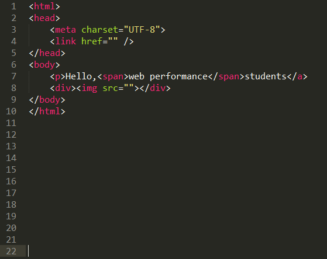
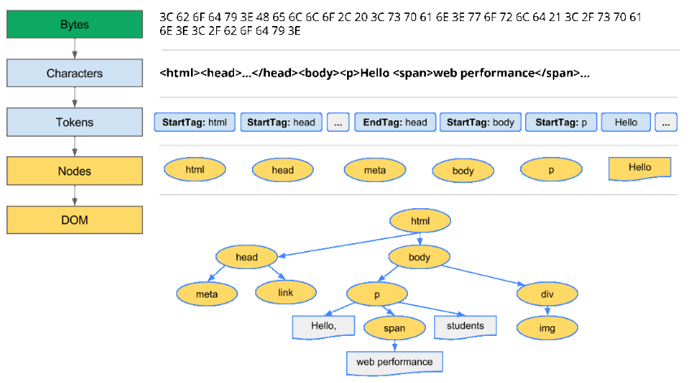
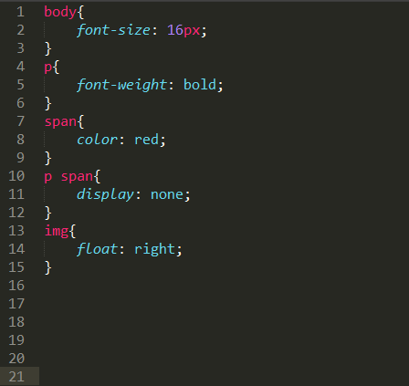
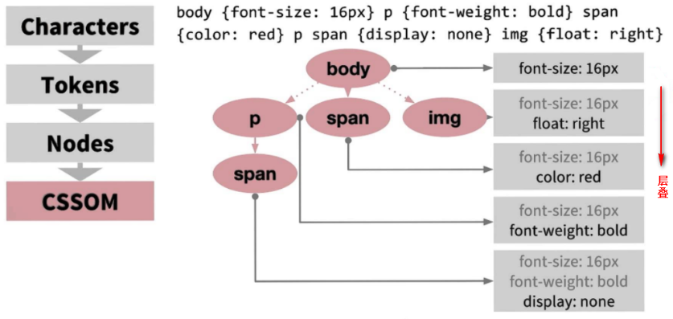

# 浏览器渲染的过程

**浏览器渲染页面的原理及流程**

浏览器将域名通过网络通信从服务器拿到html文件后，如何渲染页面呢？


1. 根据html文件构建DOM树和CSSOM树。构建DOM树期间，如果遇到JS，阻塞DOM树及CSSOM树的构建，优先加载JS文件，加载完毕，再继续构建DOM树及CSSOM树。

2. 构建渲染树（Render Tree）。

3. 页面的重绘（repaint）与重排（reflow，也有称回流）。页面渲染完成后，若JS操作了DOM节点，根据JS对DOM操作动作的大小，浏览器对页面进行重绘或是重排。

**一、构建DOM树及CSSOM树**

**1.1构建DOM树**

HTML 文档中的所有内容皆是节点，各节点之间拥有层级关系，如父子关系、兄弟关系等，彼此相连，构成DOM树。最常见的几种节点有：**文档节点、元素节点、文本节点、属性节点、注释节点**。

DOM节点树中节点与HTML文档中内容一一对应，DOM树构建过程：**读取html文档，将字节转换成字符，确定tokens（标签），再将tokens转换成节点，以节点构建 DOM 树**。如下图所示：

​           



 **1.2构建CSSOM树**

 CSS文档中，所有元素皆是节点，与HTML文件中的标签节点一一对应。CSS中各节点之间同样拥有层级关系，如父子关系、兄弟关系等，彼此相连，构成CSSOM树。

在构建DOM树的过程中，在 HTML 文档的 head 标签中遇到 link 标签，该标签引用了一个外部CSS样式表。由于预见到需要利用该CSS资源来渲染页面，浏览器会立即发出对该CSS资源的请求，并进行CSSDOM树的构建。

CSSOM树构建过程与DOM树构建流程一致：**读取CSS文档，将字节转换成字符，确定tokens（标签），再将tokens转换成节点，以节点构建 CSSOM 树**。如下图所示：

​                                              

.CSS文件，又名层叠样式表。当CSSOM树生成节点时，每一个节点首先会继承其父节点的所有样式，层叠覆盖，然后再以"向下级联"的规则，为该节点应用更具体的样式，递归生成CSSOM树。譬如，上右图中第二层的p节点，有父节点body，因此该p将继承body节点的样式："font-size: 16px;"。然后再应用该p节点自身的样式："font-weight: bold;"。所以最终该p节点的样式为："font-size: 16px;font-weight: bold;"。

**1.3加载JS**

若在构建DOM树的过程中，当 HTML 解析器遇到一个 script 标记时，即遇到了js，将立即阻塞DOM树的构建，将控制权移交给 JavaScript 引擎，等到 JavaScript 引擎运行完毕，浏览器才会从中断的地方恢复DOM树的构建。
其根本原因在于，**JS会对DOM节点进行操作，浏览器无法预测未来的DOM节点的具体内容，为了防止无效操作，节省资源，只能阻塞DOM树的构建**。譬如，若不阻塞DOM树的构建，若JS删除了某个DOM节点A，那么浏览器为构建此节点A花费的资源就是无效的。

若在HTML头部加载JS文件，由于JS阻塞，会推迟页面的首绘。为了加快页面渲染，一般将JS文件放到HTML底部进行加载，或是对JS文件执行async或defer加载。

**二.构建渲染树**

渲染树（Render Tree）由DOM树、CSSOM树合并而成，但并不是必须等DOM树及CSSOM树加载完成后才开始合并构建渲染树。三者的构建并无先后条件，亦非完全独立，而是会有交叉，并行构建。因此会形成一边加载，一边解析，一边渲染的工作现象。

构建渲染树，根据渲染树计算每个可见元素的布局，并输出到绘制流程，将像素渲染到屏幕上。

**三.页面的重绘（repaint）与重排（reflow）**

 **3.1重绘（repaint）**：屏幕的一部分要重绘。渲染树节点发生改变，但不影响该节点在页面当中的空间位置及大小。譬如某个div标签节点的背景颜色、字体颜色等等发生改变，但是该div标签节点的宽、高、内外边距并不发生变化，此时触发浏览器重绘（repaint）。

 **3.2重排（reflow）**：也有称回流，当渲染树节点发生改变，影响了节点的几何属性（如宽、高、内边距、外边距、或是float、position、display：none;等等），导致节点位置发生变化，此时触发浏览器重排（reflow），需要重新生成渲染树。譬如JS为某个p标签节点添加新的样式："display:none;"。导致该p标签被隐藏起来，该p标签之后的所有节点位置都会发生改变。此时浏览器需要重新生成渲染树，重新布局，即重排（reflow）。

注意：**重排必将引起重绘，而重绘不一定会引起重排。**

何时回引起重排？

当页面布局和几何属性改变时就需要重排。下述情况会发生浏览器重排：

1. 添加或者删除可见的DOM元素；

2. 元素位置改变——display、float、position、overflow等等；

3. 元素尺寸改变——边距、填充、边框、宽度和高度

4. 内容改变——比如文本改变或者图片大小改变而引起的计算值宽度和高度改变；

5. 页面渲染初始化；

6. 浏览器窗口尺寸改变——resize事件发生时；

**3.3如何减少和避免重排**

**Reflow 的成本比 Repaint 的成本高得多的多。**一个节点的 Reflow 很有可能导致子节点，甚至父节点以及兄弟节点的 Reflow 。在一些高性能的电脑上也许还没什么，但是如果 Reflow 发生在手机上，那么这个过程是延慢加载和耗电的。----浏览器的渲染原理简介

1. 直接改变className，如果动态改变样式，则使用cssText（考虑没有优化的浏览器）；

2. 让要操作的元素进行”离线处理”，处理完后一起更新；

a) 使用DocumentFragment进行缓存操作,引发一次回流和重绘；
b) 使用display:none技术，只引发两次回流和重绘；
c) 使用cloneNode(true or false) 和 replaceChild 技术，引发一次回流和重绘；

3.不要经常访问会引起浏览器flush队列的属性，如果你确实要访问，利用缓存；

\4. 让元素脱离动画流，减少回流的Render Tree的规模；

[浏览器渲染页面的原理及流程](https://www.cnblogs.com/chenyoumei/p/9156849.html)

# HTML5新特性

[HTML5的十大新特性](https://www.cnblogs.com/vicky1018/p/7705223.html)

# css选择器

1. 元素选择器

2. id选择器

3. 类选择器

4. 属性选择器

5. 交集选择器

   ```css
   .class1.class2{...}
   ```

6. 并集选择器 

   ```css
   .class1,.class2{...}
   ```

7. 伪元素选择器

8. 伪类选择器

9. 通配选择器

   ```css
   *{...}
   ```


**选择器优先级**

> 内联 > ID选择器 > 类选择器（类，属性，伪类） > 标签选择器。

最为优先的`!important`

**计算总的优先级**

使用选择器出现数量来确定优先级

（内联，id，类，标签）：分别表示选择器出现的数量，**从左往右依次进行比较 ，较大者胜出，如果相等，则继续往右移动一位进行比较 。如果4位全部相等，则后面的会覆盖前面的**

```html
<body>
	<nav id="nav">
  	<div class="selected">
      <a href="#">ddd</a>
    </div>
  </nav>
</body>
```

```css
#nav .selected > a:hover{color:red}             /* (0, 1, 2, 1) */
html body #nav .selected > a:hover{color:blue}  /* (0, 1, 2, 3) */
```

对比可以知道当鼠标移动到a上的时候显示的是蓝色字体


| 选择器                                                       | 例子                  | 例子描述                                            | CSS  |
| :----------------------------------------------------------- | :-------------------- | :-------------------------------------------------- | :--- |
| [.*class*](https://www.w3school.com.cn/cssref/selector_class.asp) | .intro                | 选择 class="intro" 的所有元素。                     | 1    |
| [#*id*](https://www.w3school.com.cn/cssref/selector_id.asp)  | #firstname            | 选择 id="firstname" 的所有元素。                    | 1    |
| [*](https://www.w3school.com.cn/cssref/selector_all.asp)     | *                     | 选择所有元素。                                      | 2    |
| [*element*](https://www.w3school.com.cn/cssref/selector_element.asp) | p                     | 选择所有 <p> 元素。                                 | 1    |
| [*element*,*element*](https://www.w3school.com.cn/cssref/selector_element_comma.asp) | div,p                 | 选择所有 <div> 元素和所有 <p> 元素。                | 1    |
| [*element* *element*](https://www.w3school.com.cn/cssref/selector_element_element.asp) | div p                 | 选择 <div> 元素内部的所有 <p> 元素。                | 1    |
| [*element*>*element*](https://www.w3school.com.cn/cssref/selector_element_gt.asp) | div>p                 | 选择父元素为 <div> 元素的所有 <p> 元素。            | 2    |
| [*element*+*element*](https://www.w3school.com.cn/cssref/selector_element_plus.asp) | div+p                 | 选择紧接在 <div> 元素之后的所有 <p> 元素。          | 2    |
| [[*attribute*\]](https://www.w3school.com.cn/cssref/selector_attribute.asp) | [target]              | 选择带有 target 属性所有元素。                      | 2    |
| [[*attribute*=*value*\]](https://www.w3school.com.cn/cssref/selector_attribute_value.asp) | [target=_blank]       | 选择 target="_blank" 的所有元素。                   | 2    |
| [[*attribute*~=*value*\]](https://www.w3school.com.cn/cssref/selector_attribute_value_contain.asp) | [title~=flower]       | 选择 title 属性包含单词 "flower" 的所有元素。       | 2    |
| [[*attribute*\|=*value*\]](https://www.w3school.com.cn/cssref/selector_attribute_value_start.asp) | [lang\|=en]           | 选择 lang 属性值以 "en" 开头的所有元素。            | 2    |
| [:link](https://www.w3school.com.cn/cssref/selector_link.asp) | a:link                | 选择所有未被访问的链接。                            | 1    |
| [:visited](https://www.w3school.com.cn/cssref/selector_visited.asp) | a:visited             | 选择所有已被访问的链接。                            | 1    |
| [:active](https://www.w3school.com.cn/cssref/selector_active.asp) | a:active              | 选择活动链接。                                      | 1    |
| [:hover](https://www.w3school.com.cn/cssref/selector_hover.asp) | a:hover               | 选择鼠标指针位于其上的链接。                        | 1    |
| [:focus](https://www.w3school.com.cn/cssref/selector_focus.asp) | input:focus           | 选择获得焦点的 input 元素。                         | 2    |
| [:first-letter](https://www.w3school.com.cn/cssref/selector_first-letter.asp) | p:first-letter        | 选择每个 <p> 元素的首字母。                         | 1    |
| [:first-line](https://www.w3school.com.cn/cssref/selector_first-line.asp) | p:first-line          | 选择每个 <p> 元素的首行。                           | 1    |
| [:first-child](https://www.w3school.com.cn/cssref/selector_first-child.asp) | p:first-child         | 选择属于父元素的第一个子元素的每个 <p> 元素。       | 2    |
| [:before](https://www.w3school.com.cn/cssref/selector_before.asp) | p:before              | 在每个 <p> 元素的内容之前插入内容。                 | 2    |
| [:after](https://www.w3school.com.cn/cssref/selector_after.asp) | p:after               | 在每个 <p> 元素的内容之后插入内容。                 | 2    |
| [:lang(*language*)](https://www.w3school.com.cn/cssref/selector_lang.asp) | p:lang(it)            | 选择带有以 "it" 开头的 lang 属性值的每个 <p> 元素。 | 2    |
| [*element1*~*element2*](https://www.w3school.com.cn/cssref/selector_gen_sibling.asp) | p~ul                  | 选择前面有 <p> 元素的每个 <ul> 元素。               | 3    |
| [[*attribute*^=*value*\]](https://www.w3school.com.cn/cssref/selector_attr_begin.asp) | a[src^="https"]       | 选择其 src 属性值以 "https" 开头的每个 <a> 元素。   | 3    |
| [[*attribute*$=*value*\]](https://www.w3school.com.cn/cssref/selector_attr_end.asp) | a[src$=".pdf"]        | 选择其 src 属性以 ".pdf" 结尾的所有 <a> 元素。      | 3    |
| [[*attribute*=*value*\]](https://www.w3school.com.cn/cssref/selector_attr_contain.asp) | a[src*="abc"]         | 选择其 src 属性中包含 "abc" 子串的每个 <a> 元素。   | 3    |
| [:first-of-type](https://www.w3school.com.cn/cssref/selector_first-of-type.asp) | p:first-of-type       | 选择属于其父元素的首个 <p> 元素的每个 <p> 元素。    | 3    |
| [:last-of-type](https://www.w3school.com.cn/cssref/selector_last-of-type.asp) | p:last-of-type        | 选择属于其父元素的最后 <p> 元素的每个 <p> 元素。    | 3    |
| [:only-of-type](https://www.w3school.com.cn/cssref/selector_only-of-type.asp) | p:only-of-type        | 选择属于其父元素唯一的 <p> 元素的每个 <p> 元素。    | 3    |
| [:only-child](https://www.w3school.com.cn/cssref/selector_only-child.asp) | p:only-child          | 选择属于其父元素的唯一子元素的每个 <p> 元素。       | 3    |
| [:nth-child(*n*)](https://www.w3school.com.cn/cssref/selector_nth-child.asp) | p:nth-child(2)        | 选择属于其父元素的第二个子元素的每个 <p> 元素。     | 3    |
| [:nth-last-child(*n*)](https://www.w3school.com.cn/cssref/selector_nth-last-child.asp) | p:nth-last-child(2)   | 同上，从最后一个子元素开始计数。                    | 3    |
| [:nth-of-type(*n*)](https://www.w3school.com.cn/cssref/selector_nth-of-type.asp) | p:nth-of-type(2)      | 选择属于其父元素第二个 <p> 元素的每个 <p> 元素。    | 3    |
| [:nth-last-of-type(*n*)](https://www.w3school.com.cn/cssref/selector_nth-last-of-type.asp) | p:nth-last-of-type(2) | 同上，但是从最后一个子元素开始计数。                | 3    |
| [:last-child](https://www.w3school.com.cn/cssref/selector_last-child.asp) | p:last-child          | 选择属于其父元素最后一个子元素每个 <p> 元素。       | 3    |
| [:root](https://www.w3school.com.cn/cssref/selector_root.asp) | :root                 | 选择文档的根元素。                                  | 3    |
| [:empty](https://www.w3school.com.cn/cssref/selector_empty.asp) | p:empty               | 选择没有子元素的每个 <p> 元素（包括文本节点）。     | 3    |
| [:target](https://www.w3school.com.cn/cssref/selector_target.asp) | #news:target          | 选择当前活动的 #news 元素。                         | 3    |
| [:enabled](https://www.w3school.com.cn/cssref/selector_enabled.asp) | input:enabled         | 选择每个启用的 <input> 元素。                       | 3    |
| [:disabled](https://www.w3school.com.cn/cssref/selector_disabled.asp) | input:disabled        | 选择每个禁用的 <input> 元素                         | 3    |
| [:checked](https://www.w3school.com.cn/cssref/selector_checked.asp) | input:checked         | 选择每个被选中的 <input> 元素。                     | 3    |
| [:not(*selector*)](https://www.w3school.com.cn/cssref/selector_not.asp) | :not(p)               | 选择非 <p> 元素的每个元素。                         | 3    |
| [::selection](https://www.w3school.com.cn/cssref/selector_selection.asp) | ::selection           | 选择被用户选取的元素部分。                          | 3    |

# 盒子模型

## w3c标准盒子模型


设置

```css
box-sizing:content-box;		默认
```

​		根据 W3C 的规范，元素内容占据的空间是由 width 属性设置的，而内容周围的 padding 和 border 值是另外计算的；即在标准模式下的盒模型，盒子实际内容（content）的width/height=我们设置的width/height;盒子总宽度/高度=width/height+padding+border+margin。

## ie盒子模型


设置

```css
box-sizing:border-box;
```

在该模式下，浏览器的 width 属性不是内容的宽度，而是内容、内边距和边框的宽度的总和；即在怪异模式下的盒模型，盒子的（content）宽度+内边距padding+边框border宽度=我们设置的width(height也是如此)，盒子总宽度/高度=width/height + margin = 内容区宽度/高度 + padding + border + margin。

# 布局模型

[布局模型](https://www.cnblogs.com/21-forever/p/10849768.html)

# 垂直外边距重叠问题

```html
<div class="div3">
<div class="div4"></div>
</div>
<div class="div1"></div>
<div class="div2"></div>
```

```css
.div1{
  width:100px;
  height:100px;
  background-color:red;
  margin-bottom:100px;
}
.div2{
  width:100px;
  height:100px;
  background-color:blue;
  margin-top:200px;
}

.div3{
  width:200px;
  height:200px;
  background-color:yellow;
}
.div4{
  width:100px;
  height:100px;
  background-color:green;
  margin-top:100px;
}
```

此时div1和div2的垂直方向上的外边距是200px而不是300px，div4也不是相对于div3外边距是100px,而是div3相对于页面有100px的外边距。这是因为在网页中**两个相邻**的元素**垂直方向**上的外边距会重叠，兄弟元素会区最大值，父子元素设置时，子元素的外边距会传递给父元素并且取最大值。

想要解决这个情况只需要将两个条件（相邻，垂直）破坏其中一个就可以了

方法

1. 设置border-top/border-bottom或者padding-top/padding-bottom;

   ​		这种方法会添加额外的像素

2. 设置:before/:after伪元素。

# 高度坍塌问题

父元素包裹着子元素，父元素的高度被子元素撑开，当子元素设置浮动时（脱离文档流），父元素的高度就会变成0，出现高度塌陷的问题，导致后面的元素向上移动——页面布局混乱。

父元素包裹着子元素，父元素的高度被子元素撑开，当子元素设置浮动时，父元素的高度就会变成0，出现高度塌陷的问题，导致后面的元素向上移动——页面布局混乱。

- 解决方法：开启BFC（ Block Formatting Context）块级格式化环境

  - 1.父元素的垂直外边距不会和子元素重叠
  - 2.开启BFC的元素不会被浮动元素所覆盖
  - 3.开启BFC的元素可以包含浮动的子元素

- 如何开启元素的BFC：对象是出现高度塌陷得到元素

  - 1.设置元素浮动
  	- 使用这种方式开启,虽然可以撑开父元素,但是会导致父元素的宽度丢失， 而且使用这种方式也会导致下边的元素上移,不能解决问题

  - 2.设置元素绝对定位

  - 3.设置元素为 inline-block
- 可以解决问题,但是会导致宽度丢失,不推荐使用这种方式
    
- 4.将元素的overflow设置为一个非visible的值
  - 推荐方式:将 overflow：hidden设置为是副作用最小的开启BFC的方式
  
  - 5.使用clear：both/left/right;清除受浮动对其他元素的影响

  - 6.直接在高度塌陷的父元素的最后,添加一个空白的div,并且设置clear：both

  - 7.通过after伪类，在父元素中添加一个元素，并且设置display:block;clear:both;zoom:1;

- 在IE6中虽然没有BFC,但是具有另一个隐含的属性叫做 hasLayout,  该属性的作用和BFC类似,所在工E6浏览器可以通过开 has Layout来解决该问题

- 使用zoom:1

  - zoom表示放大的意思,后边跟着一个数值,写几就将元素放大几倍  zoom:1表示不放大元素,但是通过该样式可以开启 hasLayout  z0om这个样式,只在工E中支持,其他浏览器都不支持

```css
/*即可解决高度塌陷又可以解决垂直方向上外边距重叠问题 */
.clearfix:before, 
.clearfix:after{     
  content:"";    
  display:block;     
  clear:both; 
}
```


