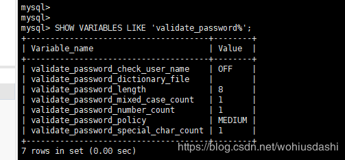

# centos系统安装图形化界面

1. 开启系统，以root身份进入

2. 安装X(X Window System)

   ```shell
   yum groupinstall "X Window System"
   ```

3. 安装GNOME(GNOME Desktop)

   ```shell
   yum groupinstall "GNOME Desktop"
   ```

4. 进入图形化界面

   ```shell
   startx
   ```


## 开机启动图形化界面

1. 首先使用ctrl+alt+f2切换到命令行模式，如果本身就是命令行模式就直接看下面的步骤

2. 查看当前开机启动模式

   ```shell
   systemctl get-default
   
   #graphical.target代表开机时启动图形化界面
   #multi-user.target代表开机时启动dos界面
   ```

3. 最后输入如下命令设置开机启动图形界面

   ```shell
   #开机启动图形界面
   systemctl set-default graphical.target 
   
   #如果想开机启动dos界面
   systemctl set-default multi-user.target 
   ```


## dos界面与图形化界面切换快捷键

图形到dos：ctrl+alt+f2
dos到图形：输入startx
或者
在命令上输入 init 3 命令 切换到dos界面
输入 init 5命令 切换到图形界面


# 安装nodejs

1. 安装wget文件下载工具

   ```shell
   yum install -y wget
   ```

2. 在下载页面https://nodejs.org/en/download/中找到下载地址，下载nodejs最新的bin包

   ```shell
   wget https://npm.taobao.org/mirrors/node/v11.0.0/node-v11.0.0.tar.gz
   ```

   也可以在其他系统上下载好之后上传到服务器

   

3. 解压包

   ```shell
   xz -d node-v9.3.0-linux-x64.tar.xz
   tar -xf node-v9.3.0-linux-x64.tar
   ```

4. 让npm和node命令全局生效

   方式一：环境变量方式（这种方式似乎只对登录用户有效？）

   　　1）、加入环境变量，在 /etc/profile 文件末尾增加配置

   ```
   vi /ect/profileexport PATH=$PATH:/usr/local/nodejs/bin
   ```

   　　2）、执行命令使配置文件生效

   ```
   source /etc/profile
   ```

   　　方式二：软链接方式（推荐）

   ```
   ln -s /usr/local/nodejs/bin/npm /usr/local/bin/
   ln -s /usr/local/nodejs/bin/node /usr/local/bin/
   ```


# 安装mysql

### **一、安装YUM Repo**

**1、由于CentOS 的yum源中没有mysql，需要到mysql的官网下载yum repo配置文件。**
**下载命令：**

```shell
wget https://dev.mysql.com/get/mysql57-community-release-el7-9.noarch.rpm
```


**2、然后进行repo的安装：**

```shell
rpm -ivh mysql57-community-release-el7-9.noarch.rpm
```

执行完成后会在/etc/yum.repos.d/目录下生成两个repo文件mysql-community.repo mysql-community-source.repo

### 二、使用yum命令即可完成安装

***注意：必须进入到 /etc/yum.repos.d/目录后再执行以下脚本***

**1、安装命令：**
`yum install mysql-server`

**2、启动msyql：**
`systemctl start mysqld #启动MySQL`

**3、获取安装时的临时密码（在第一次登录时就是用这个密码）：**
`grep 'temporary password' /var/log/mysqld.log`

**4、倘若没有获取临时密码，则**
**4.1、删除原来安装过的mysql残留的数据**

`rm -rf /var/lib/mysql`

**4.2.再启动mysql**

`systemctl start mysqld #启动MySQL`

### 三、登录：

**1、方式一（已验证）：**
`mysql -u root -p`

然后输入密码（刚刚获取的临时密码）

**2、方式二（未验证）：**
进入mysql数据库

```shell
mysql -uroot -proot   <uroot是用户名，proot是密码>
如：
root@test:/home# mysql -root -XXXX
```

**3、若登录不了，则进行以下配置，跳过登录验证**
**3.1、重置密码的第一步就是跳过MySQL的密码认证过程，方法如下：**

**3.2、vim /etc/my.cnf(注：windows下修改的是my.ini)**

在文档内搜索mysqld定位到[mysqld]文本段：

/mysqld(在vim编辑状态下直接输入该命令可搜索文本内容)

在[mysqld]后面任意一行添加“skip-grant-tables”用来跳过密码验证的过程，如下图所示：


**3.3、保存文档并退出：**

```shell
:wq
```

**3.4、接下来我们需要重启MySQL：**

### 四、登录成功后修改密码

**1、注意：这里会进行密码强度校验（密码设置时必须包含大小写字母、特殊符号、数字，并且长度大于8位）**
**2、如不满足以上条件则会报错，如下图：**


密码策略问题异常信息：

ERROR 1819 (HY000): Your password does not satisfy the current policy requirements

 

**3、解决办法：**
**3.1、查看 mysql 初始的密码策略，**

输入语句`SHOW VARIABLES LIKE 'validate_password%';`进行查看，

如下图：



**3.2、首先需要设置密码的验证强度等级，设置 validate_password_policy 的全局参数为 LOW 即可，**

输入设值语句 ` set global validate_password_policy=LOW;`进行设值，

**3.3、当前密码长度为 8 ，如果不介意的话就不用修改了，按照通用的来讲，设置为 6 位的密码，设置 validate_password_length 的全局参数为 6 即可，**

输入设值语句 “ set global validate_password_length=6; ” 进行设值，

**3.4、现在可以为 mysql 设置简单密码了，只要满足六位的长度即可，**

输入修改语句 `ALTER USER 'root'@'localhost' IDENTIFIED BY '123456';` 可以看到修改成功，表示密码策略修改成功了！！！

**3.5、注：在默认密码的长度最小值为 4 ，由 大/小写字母各一个 + 阿拉伯数字一个 + 特殊字符一个，**

只要设置密码的长度小于 3 ，都将自动设值为 4 ，

**3.6、关于 mysql 密码策略相关参数；**

1）、validate_password_length  固定密码的总长度；

2）、validate_password_dictionary_file 指定密码验证的文件路径；

3）、validate_password_mixed_case_count  整个密码中至少要包含大/小写字母的总个数；

4）、validate_password_number_count  整个密码中至少要包含阿拉伯数字的个数；

5）、validate_password_policy 指定密码的强度验证等级，默认为 MEDIUM；

关于 validate_password_policy 的取值：

LOW：只验证长度；

1/MEDIUM：验证长度、数字、大小写、特殊字符；

2/STRONG：验证长度、数字、大小写、特殊字符、字典文件；

6）、validate_password_special_char_count 整个密码中至少要包含特殊字符的个数；

 

### 五、修改密码

**1、方式一（已验证）：**
`ALTER USER 'root'@'localhost' IDENTIFIED BY '@abcd123456'; `

**2、方式二（未验证）**
`set password=password("yourpassword"); `

### 六、开启远程控制

MySQL默认是没有开启远程控制的，必须添加远程访问的用户，即默认是只能自己访问，别的机器是访问不了的。

**1、方式一（已验证）：**
　   **1.1、连接服务器: `mysql -u root -p`**

　　**1.2、看当前所有数据库：`show databases`;**

　　**1.3、进入mysql数据库：`use mysql`;**

　　**1.4、查看mysql数据库中所有的表：`show tables`;**

　　**1.5、查看user表中的数据：`select Host, User,Password from user;`**

　　**1.6、修改user表中的Host:  ` update user set Host='%' where User='root';`**  

                说明： % 代表任意的客户端,可替换成具体IP地址。

　　**1.7、最后刷新一下：`flush privileges;`**

       1.8、注意：一定要记得在写sql的时候要在语句完成后加上" ; "

**2、方式二（未验证）：**
**1、使用 grant 命令**
`grant all privileges on 数据库名.表名 to 创建的用户名(root)@"%" identified by "密码";`

**2、格式说明：**
数据库名.表名 如果写成*.*代表授权所有的数据库 flush privileges; #刷新刚才的内容

如：

`grant all privileges on *.* to root@"113.123.123.1" identified by "123456789";`

@ 后面是访问mysql的客户端IP地址（或是 主机名） % 代表任意的客户端，如果填写 localhost 为本地访问（那此用户就不能远程访问该mysql数据库了）

###  七、其他配置

1、设置安全选项：
`mysql_secure_installation`

2、关闭MySQL
`systemctl stop mysqld `

3、重启MySQL
`systemctl restart mysqld `

4、查看MySQL运行状态
`systemctl status mysqld `

5、设置开机启动
`systemctl enable mysqld `

6、关闭开机启动
`systemctl disable mysqld `

7、配置默认编码为utf8：
vi /etc/my.cnf #添加 [mysqld] character_set_server=utf8 init_connect='SET NAMES utf8'

其他默认配置文件路径： 

配置文件：/etc/my.cnf 日志文件：/var/log//var/log/mysqld.log 服务启动脚本：/usr/lib/systemd/system/mysqld.service socket文件：/var/run/mysqld/mysqld.pid

8、查看版本
`select version();`


转载自：[CentOS7下安装mysql5.7](https://blog.csdn.net/wohiusdashi/article/details/89358071)

# 安装git

1. 安装git：`yum install git `

2. 查看yum源仓库Git信息：`yum info git`

3. 安装依赖库：

   ```shell
   yum install curl-devel expat-devel gettext-devel openssl-devel zlib-devel
   yum install gcc-c++ perl-ExtUtils-MakeMaker
   ```

4. 查看git版本`git  --version`，如果默认安装的版本过低，移除默认安装的git:`yum remove git`

   

   

**查看端口使用情况**

```shell
netstat -nap #会列出所有正在使用的端口及关联的进程/应用
netstat -lnp|grep 5000 #查看指定端口

kill -9 28533 #28533是进程编号 ，-9是强制关闭，不写是普通关闭
```

