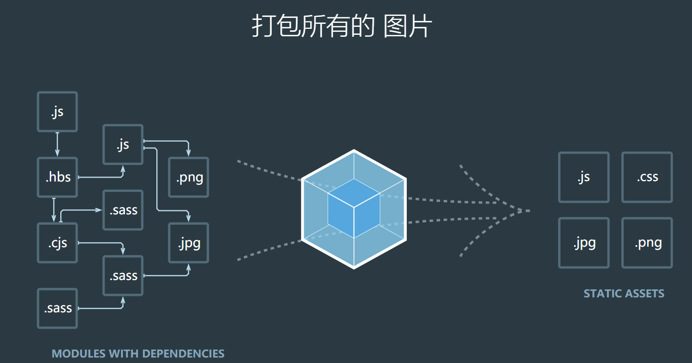
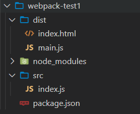
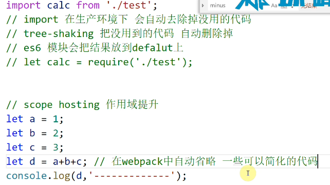

# webpack4

webpack可以看做是一个模块的打包机，它做的事情是，分析你的项目结构，找到js模块以及其他一些浏览器不能直接运行的拓展语言（scss,typescript等）,并将其打包为合适的格式以供浏览器使用。



可以做的事情

> 代码转换、文件优化、代码分割、模块合并、自动刷新、代码校验、自动发布

## 基础简介

### 安装

```shell
npm install webpack -g      #-g 代表全局安装
npm install webpack -s      #-s 代表局部安装

#webpack4以上需要安装webpack-cli
npm install webpack-cli -s  
```

### 卸载

```shell
npm uninstall webpack -g		#全局卸载
npm uninstall webpack -s		#局部卸载
```


**一、-S,-D,-g的解释**

```shell
npm install module_name -S    即    npm install module_name --save    写入dependencies
npm install module_name -D    即    npm install module_name --save-dev 写入devDependencies
npm install module_name -g 全局安装(命令行使用)
npm install module_name 本地安装(将安装包放在 ./node_modules 下)
```

**二、i是install的缩写，**
npm install module_name -S  <=> npm i module_name -S

**三、dependencies与devDependencies的区别**
devDependencies 里面的插件只用于开发环境，不用于生产环境

dependencies 是需要发布到生产环境的

比如说：

你开发一个前端项目，在项目中你需要使用gulp构建你的开发和本地运行环境,这时你就要放到devDependencies里。gulp是你用来压缩代码，打包等需要的工具，程序实际运行的时候并不需要，所以放到dev里就ok了。

你写程序要用element-ui,生产环境运行项目时肯定要用到element-ui,这时element-ui就应该安装到dependencies中去。


### **简单使用**

webpack可以进行0配置，也就是不用配置就可以直接使用了，但是这种0配置非常弱，很多地方都满足不了我们的需求。

浏览器不支持模块化，但是webpack会将js文件打包成模块，并且可以生成一个模块系统使得在浏览器上也可以使用js模块化功能。

webpack管理的是一整个项目，而且默认的项目入口文件是 项目/src/index.js 因此可以在项目中新建src文件夹，新建index.js文件；在项目目录下使用`npx webpack`打包项目，会在项目下生成 dist 文件夹，这个文件夹存放的就是打包好的文件。



在/dist文件下就可以直接引用生成的js文件了。


## webpack使用

### 安装

webpack的安装（安装webpack4以上的需要安装weboack-cli）

```shell
npm i webpack webpack-cli -D
```

webpack可以是进行0配置，但是0配置就意味着不能按我们的需求进行打包，所以还是需要我们自己进行配置的。webpack的工作过程就是用  ***打包工具 -> 输入后的结果（js模块）***

### 打包（支持我们 js 的模块化）

webpack的默认打包目录是 工程目录下的src目录，没有配置的话将会按生产环境`production`进行打包，打包出来的结果就会放到 dist下的main.js文件

```shell
# 工程目录下使用这个命令可以进行打包
npx webpack
# 这个命令的意思就是执行在node_modules目录下webpack.cmd文件，里面文件的内容就是使用node命令执行webpack.js文件
```

[npx 使用教程](http://www.ruanyifeng.com/blog/2019/02/npx.html)

### webpack的配置

webpack的默认配置文件是`webpack.config.js`一般可以放在项目根目录下，但是也可以使用其他的配置文件，在运行的时候使用`npx webpack --config 地址`指定好那个哪个配置文件就好了。

当然如果这个命令过长久可以在`package.json`文件配置一些命令来执行

```json
"scripts":{
    "build":"webpack --config webpack.dev.config.js"
}
```

在`package.json`文件下使用不需要使用 `npx `命令了，因为会主动去`node_modules/bin`下找到对应的命令

```js
//webpack.config.js  需要使用Commonjs规范导出一个对象
const path=require('path');
module.exports={
    mode:"production",//模式  默认两种 production development
    entry:path.join(__dirname,"./src/index.js"),//入口文件，是相对路径，可以使用node的path模块处理路径
    output:{//出口
    	path:path.resolve(__dirname,'./dist/'),//打包后的文件要放置的目录，必须是一个绝对路径
      filename:'boundle.[hash:8].js',//打包后的文件名 [hash:8]添加8位hash戳，不写:8，默认添加32位
	}
}
```

1. **path.join(path1，path2，path3.......)**

作用：将路径片段使用特定的分隔符（window：\）连接起来形成路径，并规范化生成的路径。若任意一个路径片段类型错误，会报错。

2. #### **path.resolve([from...],to)**

作用：把一个路径或路径片段的序列解析为一个绝对路径。相当于执行cd操作。

- **__dirname 是当前文件夹的绝对路径**
- **__filename是当前文件的绝对路径**


### **webpack-dev-server  本地开发服务**

`webpack-dev-server`默认在当前目录下开启一个服务，可以在指定的目录中开启一个本地的服务器，可以在webpack的配置文件中指定服务器目录。其好处就是不会进行真正的打包，而是会在内存中生成虚拟打包。因此不会再次从新打包内容浪费资源，支持热更新。

安装`npm i webpack-dev-server -D`，执行`npx webpack-dev-server`

在`package.json`添加命令

```json
"scripts":{
    "dev":"webpack-dev-server"
}
```

配置webpack.config.js

```js
module.exports={
    ...,
    devServer:{
        port:3000,//端口号
        progress:true,//显示开启进度条
        contentBase:'./dist/',//要开启服务的目录
        open:true,//是否自动打开浏览器
        compress:true,//开启压缩
        hot:true,//是否开启热更新
    }
}
```


### html-webpack-plugin 动态添加html模板文件

开始的时候，在项目下和打包出来的目录下是没有html文件的，我们需要自己手动添加html文件，相当麻烦，`html-webpack-plugin`插件可以将指定的模板html文件动态添加html文件到打包目录，并且会将打包出来的js文件自动添加到html文件中。

同样的在使用`webpack-dev-server`运行服务器的时候html文件也将被打包到虚拟的目录中，并不会被真正打包到输出目录，在运行`webpack`打包命令之后才会被打包到输出目录。

安装`npm i html-webpack-plugin -D`，在`webpack.config.js`添加配置

```js
const HtmlWebpackPlugin=require("html-webpack-plugin");
module.exports={
    ...,
    plugins:[//插件数组，放着所有的webpack插件实例
    	new HtmlWebpackPlugin({
            template:'./src/index.html',//将要打包的目标文件
            filename:'index.html',//打包后的文件名
    		minify:{//压缩配置
    			removeAttributeQuotes:true,//移除双引号
    			collapseWhitespace:true,//移除空格
			},
    		hash:true,//添加hash戳
        }),
    ]
}
```


### 样式处理

webpack 默认处理的是 js 文件，对于 css，ts 等文件需要使用其他的模块或者插件来处理。现在可以使用 `webpack `对 js 文件进行处理，用`html-webpack-plugin`对html文件处理并且将js文件自动导入，对于css，less，scss等样式文件就需要使用对应模块进行处理，将**样式文件**处理成**模块**，然后才可以**在入口文件 index.js 中使用 import 或者 require 进行导入。**

- **css-loader**：负责解析`@import`这种语法
- **style-loader**：负责将解析好的css文件插入到 head 的 style 标签中

**loader的用法**：只用一个loader的时候可以是一个字符串/对象`{loader:'...'}`，需要使用多个的时候是一个字符串数值。需要**注意**的是，使用多个loader的时候，要注意数组中loader的顺序，webpack将按**从右往左，从下到上**的顺序依次调用loader处理文件。处理css需要先解析再插入，所以顺序应该为`['style-loader','css-loader']`

在 webpack.config.js 配置

```js
module.exports={
    ...,
    module:{//模块
  		rules：[//规则
          {
  					test:/\.css$/,/**要处理的文件*/
  					use:[
              {
								laoder:'style-loader',
  							options:{//
										insert:'head',
                  }//如果需要用更多的 loader 配置可以使用对象的方式进行配置，比如配置这个 style 要插入的位置等。
                },
                'css-loader'
			],//处理这种文件需要使用的loader
          }
      ]
		}
}
```

如果使用的是less，或者是sass，stylus则需要先安装对应的模块先

```shell
##less
npm i less less-loader -D
##stylus
npm i stylus stylus-loader -D
##sass
npm i node-sass sass-loader -D
```

这些 .less/.scss/.stylus 文件并不是单纯的css文件他们需要先被解析成css文件才能被正常使用是，所以现在配置就会是

```js
module.exports={
    ...,
    module:{//模块
  		rules：[//规则
           {
  					test:/\.css$/,
  					use:['style-loader','css-loader']
					},
           {
  					test:/\.less$/,//先解析成css，在解析@import 再进行插入
  					use:['style-loader','css-loader','less-loader']
					},
           {
  					test:/\.scss$/,
  					use:['style-loader','css-loader','sass-loader']
					},
           {
  					test:/\.stylus/,
  					use:['style-loader','css-loader','stylus-loader']
					},
      ]
		}
}
```

配置好之后记得要在入口文件`index.js`使用 require 或者 import 进行导入，`style-loader`才会将 css 文件插入到 html 中

在这里这些 css 将会被解析成 style 样式，然后被插入到html文档中，并不是引用 css 文件，如果需要抽离css样式文件可以使用 `mini-css-extract-plugin`


### mini-css-extract-plugin 抽离css样式

这个插件可以将css抽离出来成为一个单独的文件。需要在webpack.config.js中添加配置

```js
const MCEP_CSS=require("mini-css-extract-plugin");
const MCEP_LESS=require("mini-css-extract-plugin");
const MCEP_SCSS=require("mini-css-extract-plugin");
module.exports={
    ...,
  	plugins:[//都是将css抽离成单独文件，less、scss、stylus可以使用同一个，因为最终结果都是css。
      new MCEP_CSS({filename:index.css}),//抽离出来的文件名
      new MCEP_LESS({filename:index.less.css}),
      new MCEP_SCSS({
        filename:'css/index.scss.css',//指定打包dist的css目录下，或使用outputPaht属性指定
      })
    ]
    module:{//模块
  		rules：[//规则
           {
  					test:/\.css$/,
  					use:[MCEP_CSS.loader,'css-loader']
					},
           {
  					test:/\.less$/,//先解析成css，在解析@import 再进行插入
  					use:[MCEP_LESS.laoder,'css-loader','less-loader']
					},
           {
  					test:/\.scss$/,
  					use:[MCEP_SCSS.laoder,'css-loader','sass-loader']
					},
           {
  					test:/\.stylus/,
  					use:[MCEP_CSS.loader,'css-loader','stylus-loader']
					},
      ]
		}
}
```


### postcss-loader   autoprefixer   为css属性添加浏览器前缀

使用样式的处理工具 loader 或者抽离工具都不会为css的属性添加上浏览器的前缀，这样就会导致网页在浏览器的兼容性会变差。可使用`postcss-loader`和`autoprefixer`模块进行处理

安装` npm i postcss-loader autoprefixer -D`，loader的用法都是一样的 postcss-loader 的作用就是进行css代码的转化，既然是这样那么就需要有css文件吃可以，那么配置就是`['style-loader','css-loader','postcss-loader','less-loader']`

那么 postcss-loader 也需要按照指定的规则去对css文件的属性进行转化，所以在跟目录下添加 `postcss.config.js` 文件，并且在根目录下条件浏览器限制`.browserslistrc`

```js
//postcss.config.js
module.exports={
  plugins:[require('autoprefixer')]
}

//.browserslistrc
# Browsers that we support
defaults
not IE 11
not IE_Mob 11
```

（注意：autoprefixer 需要使用7版本的）


### optimize-css-assets-webpack-plugin  css文件压缩插件

对 css 文件的压缩可以使用webpack自带的插件 `optimize-css-assets-webpack-plugin`，对css文件做一些压缩优化，但同时根据npm官网的配置要求还需要使用`uglifyjs-webpack-plugin`或者`terser-webpack.plugin`插件

添加配置

```js
const optimizeCssMini=require("optimize-css-assets-webpack-plugin");
const ug=require("uglifyjs-webpack-plugin");
module.exports={
  ...,
  optimization:{//优化项配置
  	minimizer:[
  		new ug({
        cache:true,//缓存?
        parallel:true,//并发？
  			sourceMap:true
      }),
			new optimizeCssMini(),
    ],//压缩优化
	}
}
```

需要注意的是，压缩会在 production 生成环境才会生效；现在配置了的压缩是会对入口文件 index.js 也进行压缩的，但是使用的压缩工具却只配置了针对 css 的操作，还没有对 js 进行配置所以打包的时候可能会报错。


### babel   转化 ES6 以上高级语法为 ES5 的语法

有些浏览器是不支持es6语法的但是会支持es5的语法，所以需要使用babel将高级的转化成es5的语法。

- babel-loader ：解析处理js文件				——- 8
- @babel/preset-env：es6转es5语法库    ——– 7
- @babel/core：babel核心库                     ——– 7

安装`npm i  babel-loader babel-preset-env @babel/core -D`

添加配置

```js
module.exports={
  ...,
  module:{
    rules:[
      {
				test:/\.js$/,
  			use:{
  				loader:'babel-loader',
  				options:{
              presets:[//预设装换库  es6 -> es5
                '@babel/preset-env'
              ],
              plugins:[
                '@babel/plugin-proposal-decorators',//支持提案中es6 装饰器 语法
                '@babel/plugin-proposal-class-properties',//支持提案中es6 class 语法
              ]
					},
           include:path.resolve(__dirname,'./src/'),
           exclude:/node_modules/,//默认会匹配整个项目的js文件，加上这个就是排除了node_modules目录
				}
      }
    ]
	}
}
```

如果根据现有的配置不支持 class 语法的话可以使用`@babel/plugin-proposal-class-properties`插件添加对 class 语法的支持。`@babel/plugin-proposal-decorators`，提供装饰器语法。

由于babel只会对 es6或以上的语法进行转义，所以对于 generator 生成器这种语法是不会进行转义的。我们也不能直接使用还需要其他工具帮助转化后才能使用。


### @babel/plugin-transform-runtime  处理实例上的方法

处理使用`@babel/plugin-transform-runtime`外还需要使用到` @babel/polyfill @babel/runtime`插件

安装`npm i @babel/plugin-transform-runtime @babel/polyfill -D `，`npm i @babel/runtime -S`，在根目录下添加一个`.babelrc`配置文件

```json
{
  "plugins":['@babel/plugin-transform-runtime']
}
```

或者也可以直接在webpack.config.js中配置

```js
module.exports={
  ...,
  module:{
    rules:[
      {
				test:/\.js$/,
  			use:{
  				loader:'babel-loader',
  				options:{
              presets:[
                '@babel/preset-env'
              ],
              plugins:[
                '@babel/plugin-transform-runtime'
              ]
					},
				}
      }
    ]
	}
}
```

对于`@babel/polyfill`安装之后只需要在入口文件中`require('@babel/polufill')`导入就可以了。


### eslint 	JavaScript代码规范

eslint会检查代码是否符合整体的代码风格。具体的方格配置可以在[eslint官网](https://eslint.bootcss.com/)中设置好后添加到项目中

安装`npm i eslint eslint-loader -D`，在webpack.config.js中配置规则

```js
module.exports={
  ...,
  module:{
    rules:[
      {
				test:/\.js$/,
  			use:{
  				loader:'eslint-loader',
  				options:{
             enforce:"pre",//前置loader放在最前面，最后检查
           }
				},
         exclude:/node_modules/
      }
    ]
	}
}
```

- pre	前置执行loader
- normal	普通loader
- lloader	内联loader
- fs	后置loader


### expose-loader	引入全局变量

在webpack中大多插件都是以包的形式存在，需要使用的时候再引入就好了，但是有时候希望将这些包一次全局引用，比如说 jQ 。可以使用`expose-loader`进行全局变量的引用。

```js
import $ from "jquery";
console.log(window.$);//输出会使undefined
```

可以使用`window.$=$`进行挂载。也可以使用插件进行全局暴露

安装 `npm i expose-loader -S`，添加配置

```js
//便捷使用
import $ from 'expose-loader?exposes[]=$&exposes[]=jQuery!jquery';//这个将会把这个 $ 挂载到window上

//配置使用
module.exports={
  ...,
  module:{
    rules:[
      {
				test:require.resolve('jquery'),//当使用require导入jq的时候使用
  			use:{
  				loader:'expose-loader',
  				options:{
             exposes:['$',"jQuery"],//将jquery以$暴露给window
           }
				},
      }
    ]
	}
}
```

如果想要在每个模块中都可以拿到以`$`符代表的jquery的话，可以使用 webpack 自带的注入工具

```js
const webpack=require('webpack')
module.exports={
  ...,
  plugins:[
  	new webpack.ProvidePlugin({//提供道具
  		$:'jquery',//以$符代表jquery暴露给每个模块
		})
  ]
}
```

也可以使用CDN的形式在html文件中直接引入，但是需要注意的时候如果在html中已经有引入了，那么就不要在js文件中再次`require('jquery')`了，因为再次引入会把jquery再次打包使得代码体积变大，如果非要加的话可以使用`externals`排除打包项.

```js
module.exports={
  ...,
  externals:{
  	jquery:'$',//jquery将不会被打包到boundle.js中
	}
}
```


### webpack打包图片

webpack默认只会处理打包 js 文件，如果需要处理其他的文件需要使用对应的loader进行管理使用。图片也需要使用对应的插件或者loader处理

webpack打包处理图片的方法有

1. 在js中创建图片来引入

```js
let image=new Image();
image.src='./logo.png';
document.body.appendChild(image);
```

这样写会发现路径是不对的，因为最终访问的是dist目录，而图片并不会被主动打包到dis目录下，所以需要将图片以模块的形式先导入

```js
import logo from './logo.png';
//或者可以使用logo=require('./logo.png');
```

logo将会使一个新的经过 hash 处理的图片地址。

现在可以将图片进行打包导入到dist目录，但是webpack又会提示你这个文件无法解析，所以还需要使用`file-loader`或者`url-loader`进行处理

- file-loader   默认会在内部生成一张图片，导入到dist目录下
- url-loader   做一个限制 当我们的图片小于n k的时候用base64转化，节约请求数

安装 `npm i file-loader -D`，配置

```js
module.exports={
  ...,
  module:{
  	rules:[
        /**{
          test:/.(png|jpg|gif)$/,
          use:'file-loader',
        },*/
				{
          test:/.(png|jpg|gif)$/,
          use:{
            loader:'url-loader',
            options:{
              limit:10*1024,//小于10k的时候用base64转化
  					outputPath:'img/',//打包到dist的img目录下
            }
          },
        }
    ]
	}
}
```

2. 在css中引入的图片，如`background:url('./logo.png')`，css-loader 会帮我们引入

3. 在html文件中直接使用``标签导入。这样需要使用`html-withimg-loader`处理

```js
module.exports={
  ...,
  module:{
  	rules:[
        {
          test:/.html$/,
          use:'html-withimg-loader',
        },
    ]
	}
}
```


### 打包文件分类

在webpack，对于能抽离或者报到出来的文件，都可以设置他们打包出来路径，比如对于css 使用`mini-css-extract-plugin`的filename属性可以设置保存在dist下的css目录，使用`url-loader`使用outputPath可以设置将图片保存在 img 下。

如果想要为 html 中的每个url都添加上一个服务器的地址的话可以使用

```js
module.exports={
  ...,
  output:{
    publicPath:'http://www.xxx.com/',
  }
}
```

这样打包处理的文件的 url 路径就会全部都加上 publicPath 的地址，如果想要只给图片添加的话也可以在 url-loader  中配置 publicPath

  

### 打包多页应用

webpack可以配置多页应用，根据多个入口，生成多个html页面

```js
module.exports={
  entry:{
    home:'./src/home.js',//入口1，key可以自定义
    other:'./src/other.js',//入口2
  },//多入口
  output:{
    filename:'[name][hash:8].js',//name代表entry的 key => name other
    path:path.resolve(__dirname,'./dist'),
  },
  plugins:[
    new HtmlWebpackPlugin({
      template:'./home.html',
      filename:'home.html',
      chunks:['home'],//定义要引用的代理快这里引入的home，如果不设置将会吧other.js和home.js以前引入
    }),
    new HtmlWebpackPlugin({
      template:'./other.html',
      filename:'other.html',
      chunks:['home','other'],
    }),
  ]
}
```


### source-map 	源码映射

在生产环境下使用webpack进行打包，代码会被高度压缩，并且使用`webpack-dev-server`也是会被压缩的，之前的代码格式将会改变，想要在浏览器上调试代码将变得比较困难，所以 可以使用 `devtool:'source-map'`配置源码映射

`source-map`：会单独生成一个source-map文件，出错会标识列和行

```js
module.exports={
 	...,
  devtool:'source-map',
}
```

也可以配置为`devtool:'eval-source-map'`，和 source-map 一样可以提示行和列，但是不会生成map文件，而是放到打包后的 js 文件中。

`eval-source-map`：不产生单独文件，但是显示列和行

`cheap-module-source-map`：不产生列和行，但是会生成一个单独的映射文件，产生后可以保存起来

 `cheap-module-eval-source-map`：不会产生文件，集成在打包后的文件中，不产生列。


### watch 打包监控

开启webpack的watch打包监控时，当代码有修改的时候将会同步编译并打包，和 webpack-dev-server 的热更新相识。

```js
module.exports={
  ...,
  watch:true,//开启监控
  watchOptions:{//监控的选项
		poll:1000,//每1s 检测1000次代码是否有更新
  	aggregateTimeout:500,//防抖，在不在进行修改代码操作之后的500ms后更新
  	ignored:/node_modules/,//忽略，不监控node_modules目录
  }
}
```


### clear-webpack-plugin  清除webpack插件造成的缓存

在打包的时候，输出目录下有文件，然而当我们修改了配置的输出文件名在执行打包的时候就会产生一个新的文件。这个样有可能会报错，或者多出一个文件。所以我们需要在打包之前将原来的输出目录清空。

安装`npm i clear-webpack-plugin -D`

```js
const ClearWebpackPlugin=require('clear-webpack-plugin');
module.exports={
  ...,
  plugins:[
  	new ClearWebpackPlugin('./dist'),//需要清空的目录
  ]
}
```


### copy-webpack-plugin  拷贝文件或者文件夹到输出目录

可以将一些用到的静态文件打包移动到输目录

```js
const CopyWebpackPlugin=require('copy-webpack-plugin');
module.exports={
  ...,
  plugins:[
  	new CopyWebpackPlugin([
				{from:'public',to:'./public'},//把public目录下的文件复制到dist/public下
    ]),
  ]
}
```


### bannerPlugin 	webpack内存插件，设置代码版权

如果需要打包出来的代码有自己的签名可以使用这个插件

```js
const webpack=require('webpack');
module.exports={
  ...,
  plugins:[
  	new webpack.BannerPlugin('make by me'),//会以注释的新式加入到 boundle.js 文件中
  ]
}
```


### webpack  跨域代理

`webpack-dev-server`中自带`express`所以可以直接使用express，在前端开发的首由于前后端分离开发的原因一般在开发环境中都会有跨域的问题，所以在开发的时候可以使用跨域代理来解决跨域问题，到了生产环境的时候可以使用`ngix`或者在服务端设置 `CORS`解决

**CORS方式**

```js
response.setHeader("Access-Control-Allow-Origin", "http://m.qifeng.site/");  // 第二个参数填写允许跨域的域名称，不建议直接写 "*"
response.setHeader("Access-Control-Allow-Headers", "X-Requested-With");
response.setHeader("Access-Control-Allow-Methods", "PUT,POST,GET,DELETE,OPTIONS");

// 接收跨域的cookie
response.setHeader("Access-Control-Allow-Credentials", "true");
```

**开发环境下使用代理解决**（假设服务端的端口号是3000）

1. 有服务端提供，客户端和服务端不在同一项目下。使用代理

```js
module.exports={
  ...,
  devServer:{
    port:9000,
    proxy:{
      '/api':{//检测 以 /api 开头的url地址将被代理到目标地址
        target:'http://localhost:3000',//要转发的地址
        pathRewrite:{'/api':''},//将请求转发给 http://localhost:3000时将 /api 替换为空 ' '
      }
    }
  }
}
```

**请求**

```js
let xhr=new XMLHttpRequire();
xhr.open('GET','/api/user',true);
xhr.onload=function(){
  console.log(xhr.response);
}
xhr.send();
```

这里默认的地址是 `http://localhost:9000`，但是经过代理处理后就会是`http://localhost:3000/user`

服务端代码

```js
let express=require('require');
let app=express();
app.get('/user',(req,res)=>{
  res.json({name:jack})
});
app.lisener(3000,()=>{
  console.log('server is run in :http://localhost:3000');
})
```

2. 有服务端且服务端和客户端处在同一开发环境的项目下。服务端可客户端开启相同接口的服务

```js
let express=require('require');
let app=express();
let webpack=require('webpack');
let config=require('./webpack.config.js');
let middle=require('webpack-dev-middleware');//webpack开发中间件
let complier=webpack(config);//根据配置编译好实例
app.use(middle(complier));//将webpack实例生成中间件之后挂载到express上。
app.get('/user',(req,res)=>{
  res.json({name:jack})
});
app.lisener(3000,()=>{
  console.log('server is run in :http://localhost:3000');
})
```

3. 无服务端，自模拟数据

当我们只需要获取自己写的服务端的模拟数据的时候，可以使用`webpack-dev-server`自带`express`的特性

```js
module.exports={
  devServer:{
    before(app){
      app.get('/user',(req,res)=>{
        res.json({name:'jack'})
      })
    }
  }
}
```

app：express实例

如果要使用虚拟数据最好还是使用 [mockjs](./mockjs虚拟数据.md) 虚拟数据工具。


### resolve 	指定要解析的包

webpack基于nodejs开发，应用的模块规范是commonjs 所以当查找包的时候就会是从node_modules开始往外一层一层地找，但是我们也可以通过resolve来指定需要查找的第三方包的位置

```js
module.exports={
  resolve:[
    path.resolve(__dirname,'./node_modules'),//指定在node_modules下找包
    extensions:['.js','.css','.json','.vue'],//当引入不写后缀时按当前配置顺序查找 import './index',
  	mainFields:['style','main'],//主入口文件先找style目录再找main
  	mainFiles:[],//入口文件的名字 默认index.js
  	alias:{//别名 import 'bootstrap' => import 'bootstrap/dist/css/bootstrap.css'
      bootstrap:'bootstrap/dist/css/bootstrap.css',
    }
  ]
}
```


### webpack.DefinePlugin() 	定义环境变量

```js
module.exports={
  plugins:[
    new webpack.DefinePlugin({
      DEV:'dev', // console.log(DEV) 输出的会使变量 dev
      PROD:JSON.stringify('production'),// console.log(PROD) 字符串 'production'
      FLAG:true,// console.log(FLAG)  布尔值 true
      EXPORESSION:'1+1',// console.log(FLAG)  数字 2
    })
  ]
}
```


### webpack-merge 	区分不同环境

一般在在开发的时候需要根据不同的环境进不同的配置，如开发环境下和生产环境下需要配置不同服务器地址，生成环境下需要进行压缩等优化。所以可以针对不同环境进行不同的配置，然后再将这些配置合并在执行编译或者打包。

`nppm i webpack-merge -D`，webpack-merge中有`smart`方法，用于合并配置，类似于 Object.assign()方法，可以将对象合并成一个新的对象。

```js
//公共配置 webpack.base.js
let base=require('./webpack.base.js')
let {smart}=require('webpack-merge');

//生产环境配置 webpack.prod.js
module.exports=smart(base,{
  mode:'production',
  optimization:{
    minimizer:[]
  }
})

//开发环境配置 webpack.dev.js
module.exports=smart(base,{
  mode:'development',
})
```

按需求执行打包`npm run build -- –-config webpack.dev.js`


## webpack 优化点

- **noParse**：明确知道某些包不存在其他依赖可以将这个包排除解析。

```js
module.exports={
  ...,
  module:{
    noParse:/jquery/,//不解析jquery中的依赖库。
  }
}
```

**exclude，include**：排除解析，指定解析

```js
module.exports={
  ...,
  module:{
    rules:[
      test:/\.css$/,
      use:'style-loader',
      exclude:/node_modules/,
      include:'./src/css'
  	]
	}
}
```

**weback.IgnorePlugin**：忽略引入包

**webpack.DllPlugin，webpack.DllReferencePlugin**：动态生成列表清单

**happypack**：多线程打包

提供多线程打包，加快打包编译速度；安装`npm i happypack -D`

```js
const Happypack=require('happypack');
module.exports={
  ...,
  module:{
    rules:[
      {
          test:/\.js$/,
          use:'Happypack/loader?id=js',//指定使用id为js的Happypack中的loader配置进行打包
          exclude:/node_modules/,
          include:'./src/css'
      }
  	]
	},
  plugins:[
    new Happaypack({
      id:'js',
      use:[
        {
          loader：'babel-loader',
          options:{
            presets:['@babel/preset-env'],
          }
        }
      ]
    })
  ]
}
```


**webpack自带优化**




**多页面打包抽离公共代码**

### **懒加载**

在需要使用到的时候才将模块导入

```js
let btn=document.createElement('button');
btn.innderHtml='button';
btn.addEventLisener('click',function(){
  // 使用的是jsonp实现动态加载文件
  import('./source.js').then(data=>{
    console.log(data.default);//export default 凡是导出的文件会被挂载到default上
  })
})
document.appendElement(btn);
```


### 热更新

代码修改后实时更新带页面上。但是也可以使用watch或者webpack-dev-server实现。

```js
module.exports={
  devServer:{
    hot:true,
  }
  plugins:[
  	new webpack.NameModulePlugin(),//答应更新的文件
  	new webpack.HotModuleReplacementPlugin(),//热更新插件
  ]
}
```

  

### tapable 	webpack核心